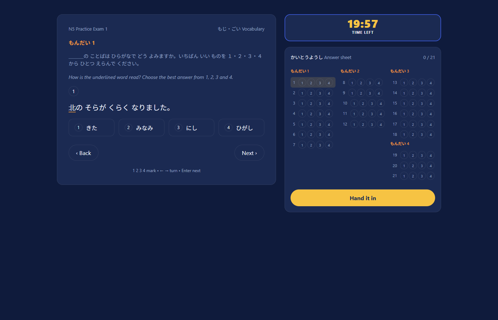

# JLPT exam section

A self-contained exam-taking screen for the N5 Vocabulary section: one question at a time, a countdown timer, and an answer sheet that doubles as navigation.



## Running it

```bash
npm install
npm run dev     # start the dev server
npm test        # run the reducer tests
npm run build   # typecheck (tsc -b) and build for production
```

## Structure

```
src/
  types.ts              exam/section/problem/question/choice data model
  data/                  the N5 exam content, typed against types.ts
  state/
    examReducer.ts       ExamState, ExamAction, and the reducer
    examReducer.test.ts  reducer tests (this is the tested surface, not the UI)
  questions.ts           getQuestionEntries: exam -> flat [{ question, problem }]
  components/            StemRenderer, ChoiceList, QuestionCard, AnswerSheet, Timer
  App.tsx                wires useReducer to the components, timer tick, keyboard shortcuts
docs/
  PLAN.md                the plan written before writing any code
```

## Key decisions

The reasoning lives in [`docs/PLAN.md`](./docs/PLAN.md); this is just the short version, so it isn't repeated here.

- **Stems are segments, not HTML strings** (`{ kind: 'text' | 'target' | 'blank' }`), so rendering never touches `dangerouslySetInnerHTML`.
- **Choices reference a `correctChoiceId`**, not a positional index, so reordering or shuffling choices can't silently break the answer key.
- **State is a single `useReducer`** with six actions (`ANSWER`, `NEXT`, `PREVIOUS`, `GOTO_QUESTION`, `TICK`, `SUBMIT`): no store library, because one exam session doesn't need one.
- **Every choice carries a `why`**, shown for right and wrong answers alike once the exam is submitted: that explanation is the actual product, not the quiz.

## What changed along the way

The plan above was written before the code, and it's left as-is on purpose: a plan that matches the implementation exactly is a plan that was edited after the fact. Two things genuinely changed shape while building:

- **Question identity in the reducer went from id to index.** The first pass kept `currentQuestionId` and had `NEXT`/`PREVIOUS`/`GOTO_QUESTION` carry the full ordered list of question ids so the reducer could find "current + 1" without knowing the exam. That worked, but it meant three of six actions had to be handed a list they didn't conceptually own. Switching to `currentQuestionIndex` + `totalQuestions` in state let `NEXT`/`PREVIOUS` become a bare `Math.min`/`Math.max` and `GOTO_QUESTION` a bounds check; the reducer stopped needing anything from the caller except a number.
- **`answers` ended up keyed by index, not by question id**; which looks like exactly the inconsistency `correctChoiceId` was introduced to avoid on the choices side. The difference: the question list itself is never reordered or shuffled within a session (unlike choices, which the plan explicitly calls out as a future shuffle candidate), so position is stable for as long as the state exists. 

## Known gaps

- **No end-to-end tests.** Vitest covers the reducer in isolation; nothing exercises the rendered UI or a full click-through of the exam.
- **No results screen.** Submitting reveals the correct choice and its `why` inline, per-question: there's no separate summary/score view (out of scope per the plan).
- **No choice shuffling.** `correctChoiceId` makes it safe to add, but nothing shuffles yet.
- **`answers` is keyed by index, not question id**: see above. Fine today; would need revisiting if questions ever became reorderable mid-session.

## About the content

The questions in `src/data/n5-exam-1.ts` are an original set written in the reference's format (stems, choices, `why` explanations): not a copy of its corpus.

