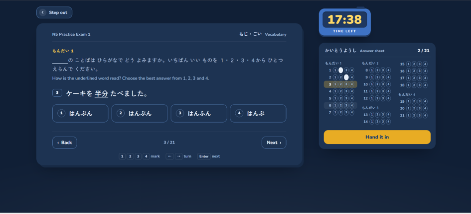
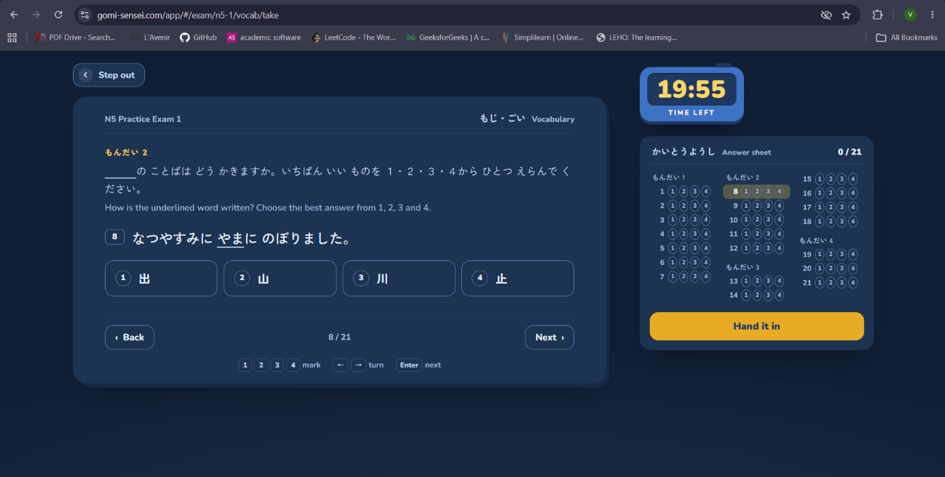
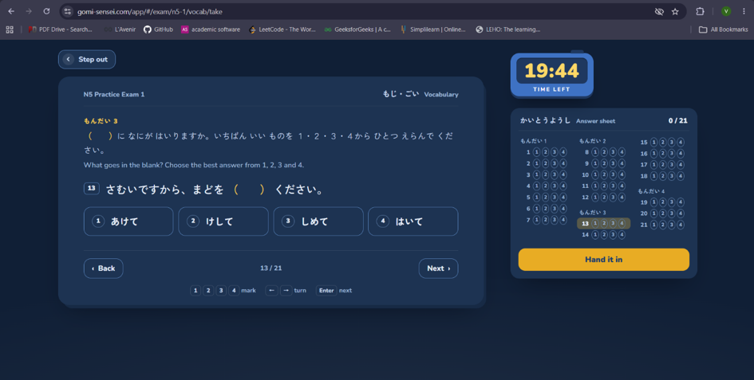
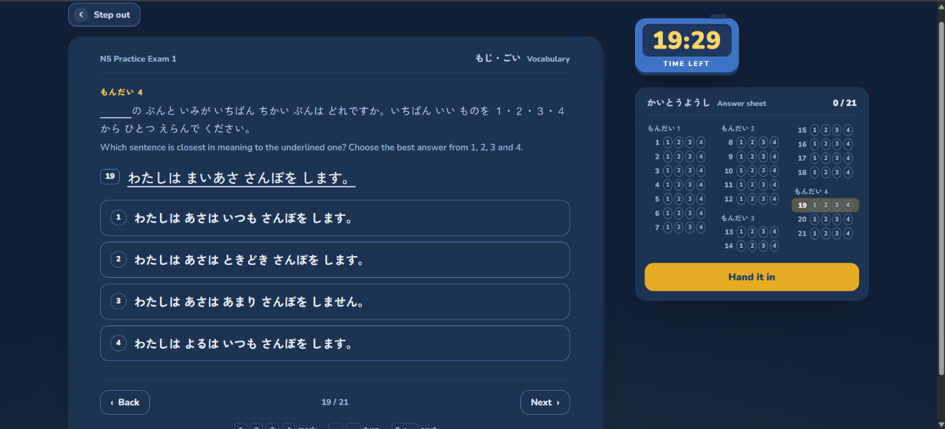

# Plan of approach

**Project:** JLPT practice exam: question section rebuild
**Reference:** gomi-sensei.com/app: N5 Practice Exam 1, Vocabulary section

## 1. Scope

A self-contained exam-taking screen: one question at a time, four choices, a countdown timer, and an answer sheet that shows progress and doubles as navigation. Runs locally, no backend.

The brief asks for a data model that handles different question types, so that is where the design effort goes. The UI stays close to the reference: replicating it costs less time than inventing a design, and it makes the review easier to follow.

**Out of scope:** the results screen after submission. It exists at `/result` and I've seen it, but the brief was one section. "Hand it in" moves the session into a submitted state where each question shows the correct choice and its explanation; the score is derivable from the answers, so a results screen would be a view on existing state rather than new logic.

## 2. Observed behaviour

Captured from the running app before writing code:

- Questions are numbered continuously (1–21) but grouped by もんだい in the answer sheet
- The instruction line belongs to the もんだい, not the question — it repeats for every question in that group
- A choice can be changed but never cleared; there is no "unanswer"
- Answering increments the counter but does not advance the question
- The answer sheet is clickable and acts as navigation; the current row is highlighted
- Choices hover light, answer sheet bubbles hover grey
- Keyboard: `1-4` to mark, `←/→` to turn, `Enter` for next
- Short choices render in a 4-column grid; full-sentence choices stack vertically
- The four もんだい, named from the results screen: Kanji reading (7), Spelling (5), Word in context (6), Same meaning (3)

| | もんだい | Questions | Task |
|---|---|---|---|
| 1 | Kanji reading | 1–7 | Underlined kanji → choose the reading |
| 2 | Spelling | 8–12 | Underlined kana → choose the kanji |
| 3 | Word in context | 13–18 | Fill the blank in the sentence |
| 4 | Same meaning | 19–21 | Choose the sentence closest in meaning |






## 3. Reading the reference implementation

The client bundle is readable, so rather than inferring the shape from the DOM I looked at the actual data structure.

```
exam → sections[] → problems[] → questions[] → choices[]
```

- `section` owns `title`, `titleEn`, `minutes`
- `problem` owns `kind`, `instructions`, `instructionsEn`
- `question` has `stem`, `en`, `choices`, `answer` (an index)
- `choice` has `t`, `why`, and an optional `word` linking to a dictionary entry

Two things stood out.

**Stems are HTML strings.** `<u>屋上</u>` sits literally in the field.

**Every choice carries a `why`, including the wrong ones.** That isn't a detail: the product description says "every answer explained," and the results screen repeats it: "A why under every choice. Even the ones you got." The explanation is the product, not the quiz.

The accessibility work is deliberate too: `role="timer"`, `aria-live="polite"` on the answer count, `aria-label` on every answer sheet button, an `sr-only` region announcing "Question 1 of 21, blank".

I've followed most of these decisions because they're good ones. Where I diverge it's deliberate, and noted below.

## 4. Data model

### Following the reference

**Section owns the duration.** `minutes` lives on the section because JLPT sections are timed differently.

**Problem owns the instruction and the kind.** All questions inside もんだい 1 are kanji-reading; that's a property of the group, not of each question. The same goes for the choice layout.

**Every choice carries an explanation.**

**Naming follows the domain.** In assessment terminology the question text is the *stem* and the alternatives are *choices*, with the correct one the key.

### Diverging, with reasons

#### Stems as segments, not HTML strings

```ts
type StemSegment =
  | { kind: 'text';   value: string }
  | { kind: 'target'; value: string }   // rendered underlined
  | { kind: 'blank' };                  // rendered as （　）
```

The reference stores `この みせは <u>午後</u> ７じまで あいて います。` and renders it as HTML. The content is first-party, so the injection risk is theoretical.

I went the other way for two reasons. It removes `dangerouslySetInnerHTML` entirely, which matters the moment any content is user-submitted or imported from a third party. And it makes the *semantics* explicit rather than the *presentation*: a blank is a blank, not a string that happens to contain （　）. If the design later wants blanks rendered as an inline input rather than parentheses, that's a renderer change and the data stays untouched.

The cost: authoring is more verbose, and a migration script would be needed to convert the existing corpus. For a content set this size that's a one-off.

#### Correct answer by id, not index

```ts
interface Choice {
  id: string;
  text: string;
  why: string;        // shown after submission, for right and wrong alike
  wordId?: string;    // links to a dictionary entry
}
```

`answer: 1` is positional. Reorder the choices; to shuffle them, or because an editor moves one; and the exam is silently wrong with no error anywhere. An id survives reordering, and shuffling choices is a feature a practice exam will eventually want.

#### Discriminated union on problem kind

```ts
type ProblemKind =
  | 'kanji-reading'
  | 'spelling'
  | 'word-in-context'
  | 'same-meaning';

interface Problem {
  id: string;
  kind: ProblemKind;
  label: string;                       // 'もんだい 1'
  instruction: { ja: string; en: string };
  choiceLayout: 'grid' | 'stack';
  questions: Question[];
}

interface Question {
  id: number;                          // continuous within the exam
  stem: StemSegment[];
  translation: string;                 // the reference's `en`
  choices: Choice[];
  correctChoiceId: string;
}
```

The union means the compiler catches an unhandled kind when a new section is added. Right now all four render identically, which is the point: the variation lives in the stem segments and the layout, not in four parallel renderers.

## 5. Tech stack and why

**React 19 + TypeScript + Vite 8.** React because it's my strongest and what the reference runs. TypeScript because the discriminated union is the whole exercise and I want the compiler enforcing exhaustiveness on it. Vite 8 because as of this year it runs Rolldown for both dev and production rather than the old esbuild-for-dev, Rollup-for-build split; one pipeline, so what I see in dev is what ships.

**State: `useReducer`, no store library.** Everything is scoped to one exam session: current index, answers, remaining time, submitted or not. Four actions. Redux or Zustand would be infrastructure without a problem to solve.

**Styling: CSS modules with custom properties.** The reference has a specific dark palette I want as tokens rather than scattered hex values, and it uses plain semantic class names. A utility framework would sit beside that rather than with it.

**Linting: oxlint.** Same Oxc toolchain that now sits under Vite 8, and considerably faster than ESLint on a project this size. I already run it on my own work.

**Data: a local TS file, typed.** No backend per the brief. The shape is API-ready, so swapping to a fetch is one function.

**Testing: Vitest on the reducer.** Answering, navigation bounds, the answered count, timer expiry, submission. Not the rendering; asserting on markup is brittle and tells you little.

### Considered and rejected

**XState.** An exam is like a state machine: idle → taking → submitted → review, with a timer that forces a transition. For a real product with multiple sections, pausing, and recovery after a refresh I'd take it seriously. For one section, a reducer with four actions is easier to read and easier to test.

**Next.js.** No server, no SSR, no data fetching, no routing depth.

**Vue.** I've used it professionally, but React matches the reference and my own depth is greater.

**React Compiler.** Stable in 19, but this isn't a render-heavy app and the reducer already keeps re-renders narrow.

## 6. Accessibility

Not an afterthought, because it isn't one in the reference. `role="timer"` on the clock, `aria-live="polite"` on the answer count, `aria-label` on each answer sheet button carrying both the question number and its current state, and a visually-hidden live region announcing the current question on navigation.

## 7. Build order

1. Model and seed data: all 21 questions. The answer sheet is one of the four UI elements and looks sparse with a subset
2. Reducer and its tests, with no UI at all
3. Stem renderer driven by the segment model
4. Answer sheet, grouped by problem, clickable
5. Timer, keyboard shortcuts, hover and focus states
6. Explanations revealed after submission
7. README